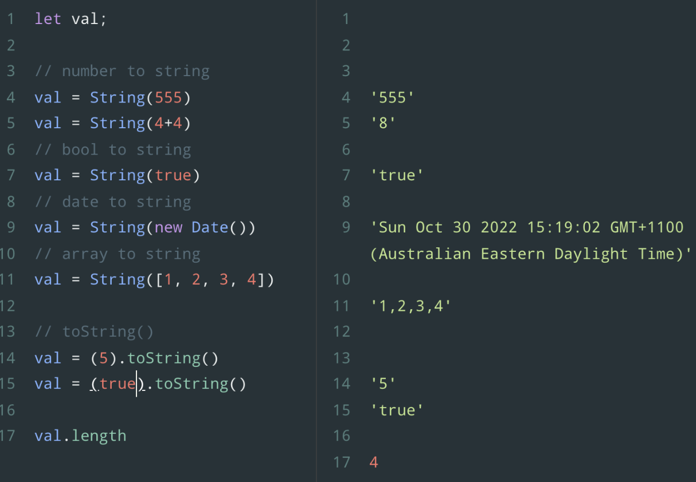

# Console.log

```js
console.log({ a: 1, b: 2 })
```

This would be logging out an object literal to the console

```js
console.table({ a: 1, b: 2 })
```

Prints the object out as a table

```js
console.error('This is an error)
```

Logs out an error to the console, highlighted in red

```js
console.time('Hello')
console.log('Hello world')
console.log('Hello world')
console.log('Hello world')
console.log('Hello world')
console.log('Hello world')
console.timeEnd('Hello')
```

console.time and console.timeEnd will output how long it has taken for your code to run in between the time and timeEnd.

# Varibales

Let and const have a big advantage when it comes to block scoping.

You can initialise a variable by just declaring it with a name, it’s initial value is undefined.

```js
var greeting
```

The only characters that can be inside of a variable are letters, numbers, \_, $, but they cannot start with a number.

You can use $ to declare a variable, usually we will be declaring variables with \_ or $ in more advanced patterns, such as declaring private variables.

Multi word variables

```js
var firstName = 'John' // camel case
var first_name = 'John' // snake case
var FirstName = 'Jon' // pascal case
```

When we get into OOP, constructor functions should start with an uppercase (pascal case), ES6 classes should be declared in pascalcase.

Let and const are identical on the global scope, block level scoping is where the advantages come into play for let.

```js
const person = {
  name: 'John',
  age: 30,
}

person.name = 'Sarah'
person.age = 32

const numbers = [1, 2, 3, 4, 5]
numbers.puh(6)

console.log(numbers) // output: [1, 2, 3, 4, 5, 6]
```

If a const is assigned to an array or an object or another reference type we can actually mutate or assign new values to the data in that structure, we just can’t re-assign the const - aka. It can’t be assigned as a new primitive value.

- This makes our code more robust, more secure, and ultimately more readable

# Data types

#### In JavaScript we have two types of data:

##### Primitive data types

- Stored directly in the location the variable accesses
- Stored on the stack
  - When we access primitive data we access it by its actual value

##### Reference data types

- Accessed by reference
  - Data isn’t actually stored in the variable
- Objects that are stored on the heap
  - It’s stored on what’s called the heap, which has to do with dynamically allocated memory.
- A pointer to a location in memory

##### Primitive data types include:

- String
- Number
  - Integers, decimals, floats are all considered numbers in JS. Some other languages there’s decimal types, float types and - they’re treated as separate types.
- Boolean
- Null
  - Intentional empty value
- Undefined
  - Variable which has not been assigned a value
- Symbols (ES6)

##### Reference data types (considered objects)

- Arrays
- Object literals
- Functions
- Dates
- Anything else.. That you can store.

##### JS is a dynamically typed language:

- Data types are associated with values not variables
- The same variable can hold multiple data types
  - Whereas in most languages which are statically typed like Java, C#, this isn’t allowed.
  - In fact in many languages you actually have to define what type of value is going to be in that variable (There are technologies that can turn JS into a statically typed language, TS is most popular, being a superset of JS - meaning it is everything that JS offers plus more on top of that. There are also other modules and addons like Flow or Flow.js which can give us typing in JS.
  - But at it’s core JavaScript is very dynamic in nature

###### Primitive types: The actual data is being accessed in that variable.

In JS this is kindof a mistake or bug, null has 0 as a type tag, hence the bogus `typeof` return value (reference) object.

```js
const car = null

console.log(typeof car) // output: 'object'
```

###### Reference types: The variable is simply referencing a place in memory where that data is located.

```js
// REFERENCE TYPES - Objects
// Array
const hobbies = ['movies', 'music']
// Object literal
const address = {
  city: 'Boston',
  state: 'MA',
}
// Date generator
const today = new Date()
```

#### Type conversion

Forms return strings by default so we have to parse the input to e.g. do some calculations on it.



Nan => Not a number: Will get output when a value is attempted to get parsed as a number but cannot. E.g. When we do something like below:

```js
let value = Number('hello')

console.log(value) // Output: NaN
```

```js
let value = Number([1, 2, 3])

console.log(value) // Output: NaN
```

```js
parseInt('100.30') // Output: 100
parseFloat('100.30') // Output: 100.3
```

###### Type Coercion: JS does the type conversion for us instead of us typing it out

```js
const value1 = '5'
const value2 = 6

const sum = value1 + value2

console.log(sum) // output: '56'
```

This is an example of type coercion as JS automatically converts value2 to a string and concatenates the two values to make the string ‘56’.

# OOP

#### ES5

##### Constructor functions and the `this.` keyword

- Constructor and this keyword
- It's important to learn how it works under the hood with ES5
- ES6 classes are basically syntactic sugar (convenience syntax)
  - Make it easier to write object oriented code, similar to Java, C#, PHP - any language that has classes

```js
const brad = {
  name: 'Brad',
  age: 30,
}

console.log(brad)
console.log(brad.age)
```

The above is fine when you want to create a single instance of an object, but when you want to create multiple instances of a certain type of object then you are going to want to create a constructor. You will use the following with constructors:

- Prototypes
- Inheritance

```js
// Below is the constructor
function Person(name, age, dob) {
  this.name = name
  this.age = age
  this.birthday = new Date(dob)
  this.calculateAge = function () {
    const diff = Date.now() - this.birthday.getTime()
    const ageDate = new Date(diff)
    return Math.abs(ageDate.getUTCFullYear() - 1970)
  }
}

const brad = new Person('Brad', 36, '11/06/1981')
const john = new Person('John', 30, '09/10/1999')

console.log(brad) // output: Person { name: 'Brad', age: 36, dob: Thu Sep 10 1981 00:00:00 }
console.log(john) // output: Person { name: 'John', age: 30, dob: ... }

console.log(brad.calculateAge()) // output: 36
```

The above is the basis of constructors in the core ES5 context.

##### Built in constructors

```js
// Strings

const name1 = 'Jeff'
const name2 = new String('Jeff')

console.log(name2)

console.log(typeof name1) // output: string
console.log(typeof name2) // output: object

// Numbers
const num1 = 5
const num2 = new Number(5)

// Boolean
const bool1 = true
const bool2 = new Boolean(true)

// Function
const getSum1 = function (x, y) {
  return x + y
}
const getSum2 = new Function('x', 'y', 'return 1 + 1')

// Object
const john1 = { name: 'John' }
const john2 = new Object({ name: 'John' })

// Arrays
const arr1 = [1, 2, 3, 4]
const arr2 = new Array(1, 2, 3, 4)

// Regular Expressions
const re1 = /\w+/
const re2 = new RegExp('\\w+')
```

There are not too many uses for the above, so you generally want to stay away from these kinds of generators.

##### Prototypes Explained

Each object in JS has a prototype, a prototype is an object itself.

All objects inherit their properties and methods from their prototype. When you are dealing with object literals, you are inheriting from a prototype called `Object.prototype` but objects that were created through a constructor you access them from `Person.prototype`.

```js
function Person(firstName, lastName, dob) {
  this.firstName = firstName
  this.lastName = lastName
  this.birthday = new Date(dob)
}

// The below assignment to prototype allows us not to
// flood the constructor with methods 
Person.prototype.calculateAge = function () {
  const diff = Date.now() - this.birthday.getTime()
  const ageDate = new Date(diff)
  return Math.abs(ageDate.getUTCFullYear() - 1970)
}

Person.prototype.getFullName = function () {
  return `${this.firstName} ${this.lastName}`
}

Person.prototype.getsMarried = function (newLastName) {
  this.lastName = newLastName
}

const john = new Person('John', 'Doe', '8-12-90')
const mary = new Person('Mary', 'Johnson', 'March 20 1978')

// __proto__
// 
```

##### Prototypal Inheritance 

We will have a customer object that will inherit it's prototype 

```js
function Person(firstName, lastName) {
  this.firstName = FirstName
  this.lastName = lastName 
}

Person.prototype.greeting = function() {
  return `Hello there ${this.firstName} ${this.lastName}`
}

const person1 = new Person('John', 'Doe')

console.log(person1.greeting()) // output: Hello there John Doe

// Customer constructor 
function Cutstomer(firstName, lastName, phone, membership) {
  Person.call(this, firstName, lastName)

  this.phone = phone
  this.membership = membership
}

// Inherit the Person prototype methods 
Customer.prototype = Object.create(Person.prototype)

// Make customer.prototype return Customer()
Customer.prototype.constructor = Customer

const customer1 = new Customer('Tom', 'Smith', '555-555-5555', 'Standard')

console.log(customer1.greeting()) // output: err: is not a function

Customer.prototype.greeting = function() {
  return `Hello there ${this.firstName} ${this.lastName} welcome to our company!`
}
```

##### Using `Object.create` 

Create prototypes inside of a parent object, give them different properties with different methods. 

```js
const personPrototypes = {
  greeting: function() {
    return `Hello there ${this.firstName} ${this.lastName}`
  },
  getsMarried: function(newLastName) {
    this.lastName = newLastName
  }
}

// The below gives us an alternative way to create objects given the Object.create() method 
const mary = Object.create(personPrototypes)
mary.firstName = 'Mary'
mary.lastName = 'Williams'
mary.age = 30

console.log(mary.greeting()) // output: Hello there Mary Williams

const brad = Object.create(personPrototypes, {
  firstName: {value: 'Brad'},
  lastName: {value: 'Traversy'},
  age: {value: 36}
})

console.log(brad) // output: {firstName: "Brad", lastName: "Traversy"}
console.log(brad.greeting()) // output: Hello there Brad Traversy
```
# ES6 Classes 

We are basically creating a class, constructor and we have methods and properties inside of our class. 

Under the hood, in the JS engine, it works almost the exact same way as ES5. The ES6 way is called syntactic sugar because it's changing the way we write it but not the way that it works under the hood. 
```js
class Person {
  constructor(firstName, lastName, dob) {
    this.firstName = firstName
    this.lastName = lastName
    this.birthday = new Date(dob)
  }

  greeting() {
    return `Hello there ${this.firstName} ${this.lastName}`
  }

  calculateAge() {
    const diff = Date.now() - this.birthday.getTime()
    const ageDate = new Date(diff)
    return Math.abs(ageDate.getUTCFullYear() - 1970)
  }

  getsMarried(newLastName) {
    this.lastName = newLastName
  }

  static addNumbers(x, y) {
    return x + y
  }
}

// We are instantiating a new object from the class 
const mary = new Person('Mary', 'Williams')

mary.getsMarried('Thompson')

console.log(mary.greeting())

console.log(Person.addNumbers(1 + 2)) // output: 3
```